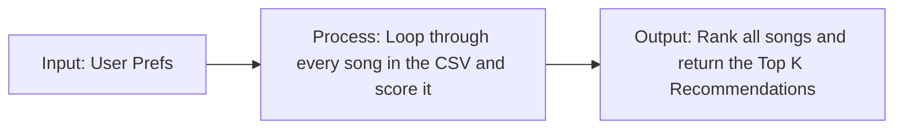

# 🎵 Music Recommender Simulation

## Project Summary

In this project you will build and explain a small music recommender system.

Your goal is to:

- Represent songs and a user "taste profile" as data
- Design a scoring rule that turns that data into recommendations
- Evaluate what your system gets right and wrong
- Reflect on how this mirrors real world AI recommenders

Replace this paragraph with your own summary of what your version does.

---

## How The System Works

Real-world recommenders usually combine a few strong signals instead of relying on one feature alone. In this simulation, I will prioritize a simple content-based approach that gives the most weight to how closely a song matches the user's preferred genre, mood, and target energy, then use the remaining audio features to fine-tune the final score. Songs that are closer to the user's taste profile should score higher, and the top-scoring songs will be recommended first.

My plan is:

1. Read the user's taste profile from the input data.
2. Loop through every song in the CSV and judge it one by one.
3. Assign points for genre, mood, energy similarity, acousticness, and smaller tie-breakers.
4. Sort the songs by total score.
5. Return the top `k` recommendations.

The simulation will use these features:

- `Song`: `id`, `title`, `artist`, `genre`, `mood`, `energy`, `tempo_bpm`, `valence`, `danceability`, `acousticness`
- `UserProfile`: `favorite_genre`, `favorite_mood`, `target_energy`, `likes_acoustic`

The recommender will compare songs against a taste profile like this:

```python
taste_profile = {
   "favorite_genre": "rock",
   "favorite_mood": "intense",
   "target_energy": 0.88,
   "likes_acoustic": False,
}
```

Prompt for critique: Does this user profile give the recommender enough information to tell the difference between "intense rock" and "chill lofi," or is it too narrow to handle more than one listening style? How should the point weights be balanced so a mood match matters relative to a genre match, and what would you change to make it more flexible without losing specificity?

### Algorithm Recipe

My program will score each song with a simple rule-based content match, then sort all songs from highest score to lowest score. The main rules are:



- Give `+2.0` points when the song's `genre` matches the user's favorite genre.
- Give `+1.0` point when the song's `mood` matches the user's favorite mood.
- Add similarity points based on how close the song's `energy` is to the user's target energy.
- Add a small bonus or penalty for `acousticness` depending on whether the user likes acoustic songs.
- Use `tempo_bpm`, `valence`, and `danceability` as smaller tie-breakers so songs with similar genre and mood can still be ordered more carefully.
- Return the top `k` songs after sorting by score.

In short, the recipe is: score one song by comparing it to the user's preferences, then rank all songs by that score and recommend the best matches first.

Potential bias: this system might over-prioritize genre and mood matches, so it could miss great songs that fit the user's energy or overall vibe but do not match the favorite genre exactly.

---

## Getting Started

### Setup

1. Create a virtual environment (optional but recommended):

   ```bash
   python -m venv .venv
   source .venv/bin/activate      # Mac or Linux
   .venv\Scripts\activate         # Windows

2. Install dependencies

```bash
pip install -r requirements.txt
```

3. Run the app:

```bash
python -m src.main
```

### Running Tests

Run the starter tests with:

```bash
pytest
```

You can add more tests in `tests/test_recommender.py`.

---

## Sample Recommendation Output

```text
Loading songs from data/songs.csv...

Top recommendations:

1. Sunrise City
   Final score: 5.92
   Reasons:
   - genre match (+2.0)
   - mood match (+1.0)
   - energy closeness (+1.96)
   - non-acoustic preference (+0.41)
   - tempo closeness (+0.25)
   - valence closeness (+0.15)
   - danceability closeness (+0.15)

2. Gym Hero
   Final score: 4.77
   Reasons:
   - genre match (+2.0)
   - energy closeness (+1.74)
   - non-acoustic preference (+0.47)
   - tempo closeness (+0.25)
   - valence closeness (+0.15)
   - danceability closeness (+0.15)

3. Rooftop Lights
   Final score: 3.79
   Reasons:
   - mood match (+1.0)
   - energy closeness (+1.92)
   - non-acoustic preference (+0.33)
   - tempo closeness (+0.25)
   - valence closeness (+0.15)
   - danceability closeness (+0.15)

4. Night Drive Loop
   Final score: 2.84
   Reasons:
   - energy closeness (+1.90)
   - non-acoustic preference (+0.39)
   - tempo closeness (+0.25)
   - valence closeness (+0.15)
   - danceability closeness (+0.15)

5. Storm Runner
   Final score: 2.78
   Reasons:
   - energy closeness (+1.78)
   - non-acoustic preference (+0.45)
   - tempo closeness (+0.25)
   - valence closeness (+0.15)
   - danceability closeness (+0.15)
```

**Screenshot or video** *(optional)*: <!-- Insert a screenshot or demo video link here -->

---

## Experiments You Tried

Use this section to document the experiments you ran. For example:

- What happened when you changed the weight on genre from 2.0 to 0.5
- What happened when you added tempo or valence to the score
- How did your system behave for different types of users

---

## Limitations and Risks

Summarize some limitations of your recommender.

Examples:

- It only works on a tiny catalog
- It does not understand lyrics or language
- It might over favor one genre or mood

You will go deeper on this in your model card.

---

## Reflection

Read and complete `model_card.md`:

[**Model Card**](model_card.md)

Write 1 to 2 paragraphs here about what you learned:

- about how recommenders turn data into predictions
- about where bias or unfairness could show up in systems like this


